# LLM / vLLM 로컬 GPU 환경 세팅 가이드 ( Windows + WSL2 )

**Windows 환경에서 WSL2 + NVIDIA GPU를 활용하여 vLLM 기반 LLM 서빙 서버를 구성**

---

## 0. 사전 요구사항

- Windows 11
- NVIDIA GPU (GeForce RTX 5090)
- NVIDIA GPU Driver
---

## 1. WSL2 설치 ( Windows Subsystem for Linux )

### 1-1. Windows 기능 설정

제어판 → 프로그램 → 프로그램 및 기능 → Windows 기능 켜기/끄기

아래 항목 체크 후 **재부팅**:
- Linux용 Windows 하위 시스템
- 가상 머신 플랫폼


### 1-2. WSL2 설정 

- PowerShell 관리자 권한으로 실행

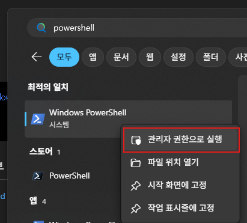

```powershell
# WSL 기본 버전을 2로 설정
wsl --set-default-version 2

# 설치 가능한 배포판 목록 확인
wsl -l -o

# Ubuntu 24.04 설치 ( 설치 도중 Unix Account 생성 )
wsl --install -d Ubuntu-24.04
```

### 1-3. 기본 사용 명령어

- Linux 실행 : wsl
- Linux 종료 : exit
- 설치 확인 : wsl -l -v

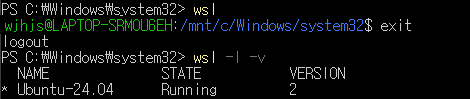

## 2. Anaconda 설치 ( WSL 내부 )

### 2-1. 다운로드 링크 복사

- https://www.anaconda.com/download 접속


- 링크 복사

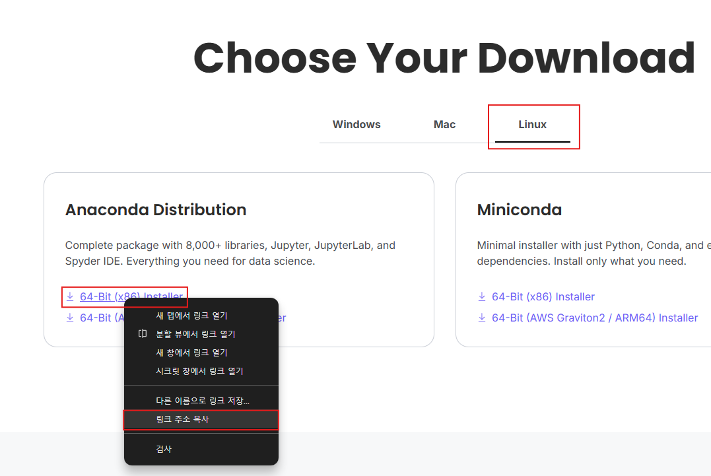

### 2-1. 다운로드 및 설치

- Powershell WSL Linux 실행

```bash
# 경로 이동
cd /home/{1-2. 에서 생성한 Unix Account Name}

# 설치 파일을 저장할 폴더 생성 
mkdir installers

# 설치 파일 폴더로 이동
cd installers 

# Anaconda Linux 설피 파일 다운로드 ( wget { download link } )
wget https://repo.anaconda.com/archive/Anaconda3-2025.12-1-Linux-x86_64.sh

# Anaconda 설치 실행 ( 설치 과정에서 나오는 질문은 yes 입력 )
bash Anaconda3-2025.12-1-Linux-x86_64.sh
```

- PowerShell 에서 WSL 재실행 ( base 표시 확인 )

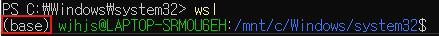

## 3. Visual Studio Code 설치

### 3-1. 다운로드 및 설치

- https://code.visualstudio.com/ 접속, 설치파일 다운로드

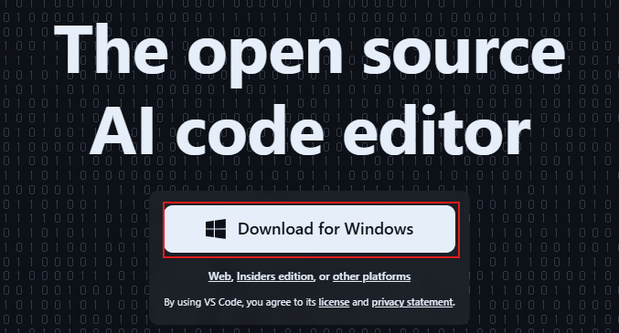

- 설치파일 실행

### 3-2. Extensions 설치 및 WSL 접속

- Extensions 탭에서 python, jupyter, wsl 검색 후 설치

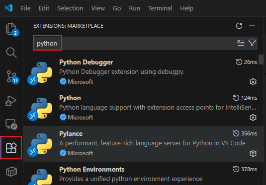

- ctrl + shift + p -> Command Palette (명령 팔레트) -> WSL:Connect to WSL

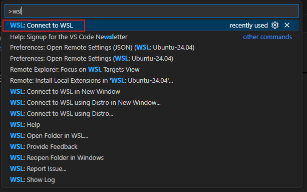

- ctrl + shift + ` -> terminal 실행

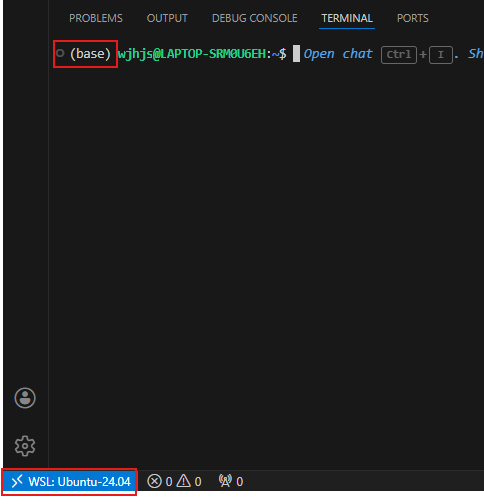

## 4. GPU 세팅

### 4-1. GPU 확인

- 장치관리자 > 디스플레이 어댑터 > GPU 확인 ( GeForce RTX 5090 )

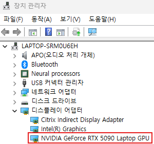

- https://ko.wikipedia.org/wiki/CUDA 접속 후 컴퓨팅 기능과 CUDA SDK 버전 확인

1. 컴퓨팅 기능 ( 12.0 )

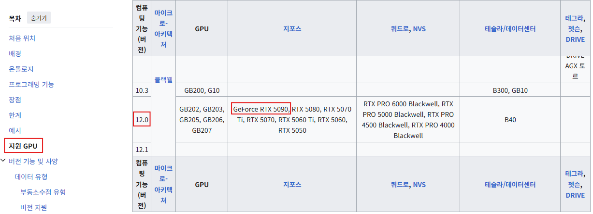

2. CUDA SDK 버전 ( 12.8 ~ )

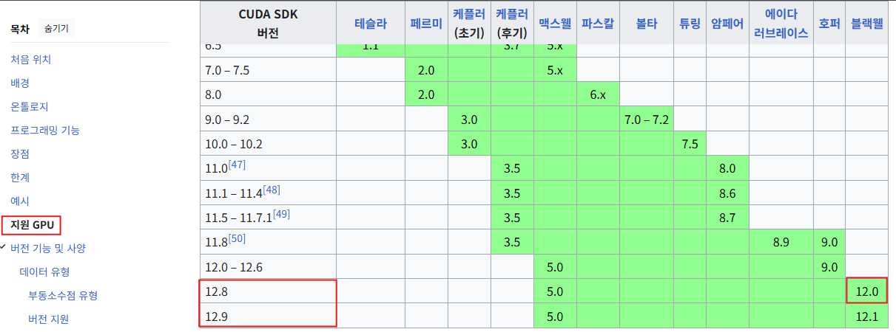

### 4-2. CUDA 설치

- https://developer.nvidia.com/cuda-toolkit-archive 접속

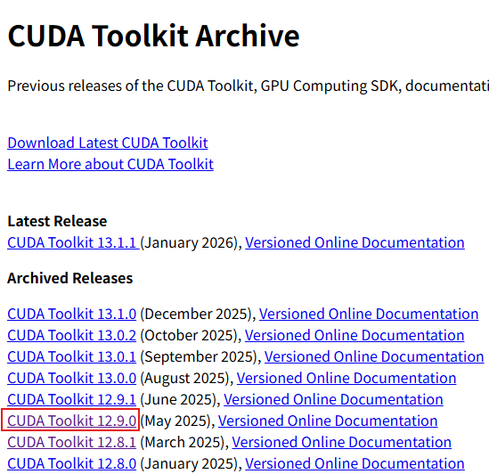

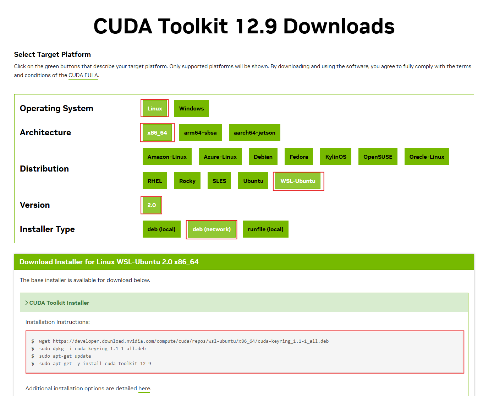

- VS Code의 WSL접속 모드 터미널 or PowerShell WSL Linux 에서 아래 명령어 실행
```bash
# 경로이동
cd /home/{1-2. 에서 생성한 Unix Account Name}

# 설치 파일 폴더로 이동
cd installers

# CUDA 홈페이지에서 복사한 코드 실행
wget https://developer.download.nvidia.com/compute/cuda/repos/ubuntu2404/x86_64/cuda-keyring_1.1-1_all.deb
sudo dpkg -i cuda-keyring_1.1-1_all.deb
sudo apt-get update
sudo apt-get -y install cuda-toolkit-12-9

# bashrc 파일 편집
vim ~/.bashrc 
```

- 환경변수 설정

1. 터미널에서 'a' ( 편집 모드 ) 키 입력 -> 환경변수 추가

```bash
export PATH=/usr/local/cuda-12.9/bin:$PATH
export LD_LIBRARY_PATH=/usr/local/cuda-12.9/lib64:$LD_LIBRARY_PATH
```

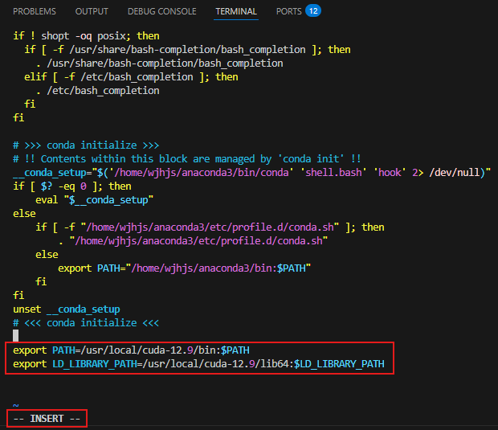

2. Esc ( 편집 모드 종료 ) -> : ( 종료 옵션 ) 키 입력 -> wq ( 저장 후 종료 ) 입력 -> Enter

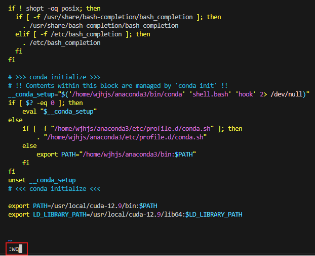

```bash
# 환경변수 편집 내용 적용
source ~/.bashrc

# CUDA 설치 확인
nvcc --version
```

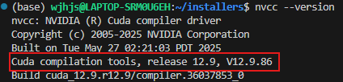

### 4-3. cuDNN 설치

- https://developer.nvidia.com/rdp/cudnn-archive 접속, CUDA 버전( 12.9 )과 맞는 최신 cuDNN 다운로드 ( Linux용 tar 파일 ) - **회원가입** 필요

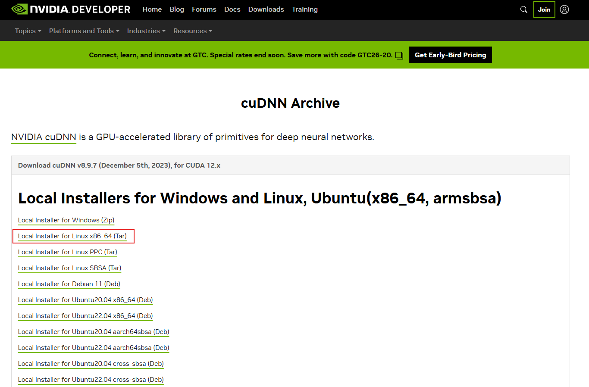

- 파일 탐색기에서 windows로 다운받은 설치파일을 linux ( /home/wjhjs/installers/ ) 로 이동

1. windows download

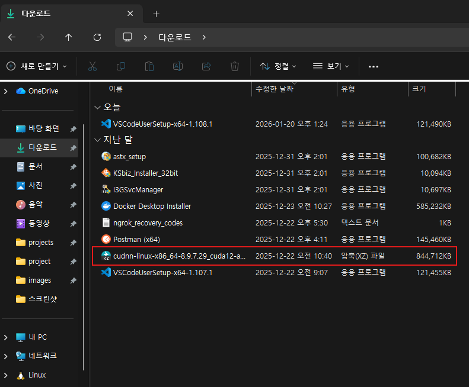

2. linux ( /home/wjhjs/installers/ )

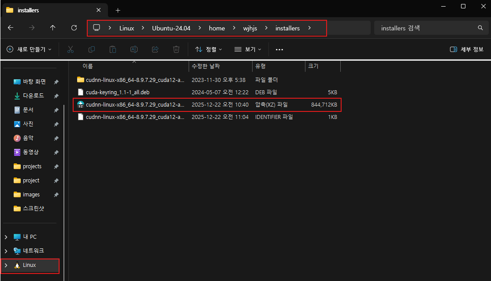

- 압축 풀고 설치

```bash
# 설치 파일이 있는 경로로 이동
cd /home/wjhjs/installers/

# cuDNN 설치 파일이 있는 디렉터리로 이동
cd /home/wjhjs/installers/

# 다운로드한 cuDNN 압축 파일(.tar.xz) 해제
tar -xvf cudnn-linux-x86_64-8.9.7.29_cuda12-archive.tar.xz

# cuDNN 헤더 파일(cudnn*.h)을 CUDA include 디렉터리로 복사
sudo cp cudnn-linux-x86_64-8.9.7.29_cuda12-archive/include/cudnn*.h \
  /usr/local/cuda-12.9/include

# cuDNN 라이브러리 파일(libcudnn*)을 CUDA lib64 디렉터리로 복사
sudo cp -P cudnn-linux-x86_64-8.9.7.29_cuda12-archive/lib/libcudnn* \
  /usr/local/cuda-12.9/lib64

# 모든 사용자에게 cuDNN 라이브러리 읽기 권한 부여
sudo chmod a+r /usr/local/cuda-12.9/lib64/libcudnn*

# cuDNN 설치 확인
cat /usr/local/cuda/include/cudnn_version.h | grep CUDNN_MAJOR -A 2
```

- cuDNN 8.9.7 확인

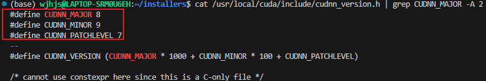

## 5. vLLM 세팅

### 5-1. conda 가상환경

```bash
# Python 3.12 가상환경 생성 ( conda create -n { 가상환경 이름 } python=3.12 )
conda create -n axtft python=3.12

# 가상환경 실행 ( conda activate { 가상환경 이름 } )
conda activate axtft

# 필요 패키지 설치
pip install vllm==0.13.0
pip install timm
pip install fastapi
```

### 5-2. 모델 다운로드
```bash
# 가상환경 실행
conda activate axtft

# hugging face 로그인
hf auth login
```

- hugging face token 입력 ( hugging face 회원가입 후 토큰 생성 가능 ), Add token as git credential? (Y/n) -> n 입력

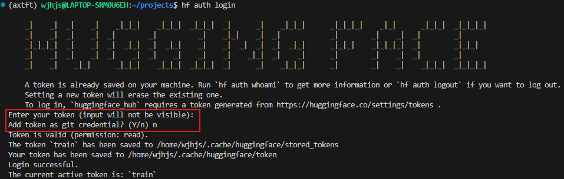

- 모델 다운로드 ( hf download { hugging face 모델명 } --local-dir { 저장할 경로 } )

```bash
# gpt-oss-20b 모델 다운로드
hf download openai/gpt-oss-20b --local-dir ./models/gpt-oss-20b

# gemma-3n-E4B-it 모델 다운로드
hf download google/gemma-3n-E4B-it --local-dir ./models/gemma-3n-E4B-it
```

### 5-3. vLLM 서빙

```bash
conda activate axtft
# Anaconda 가상환경 axtft 활성화
# → tiktoken, openai_harmony, vLLM 등 패키지가 설치된 환경으로 전환

sudo mkdir -p /etc/encodings
# tiktoken 인코딩 파일을 저장할 시스템 디렉토리 생성
# -p 옵션: 이미 존재해도 에러 없이 통과

sudo chmod 755 /etc/encodings
# encodings 디렉토리 권한 설정
# root: 쓰기 가능 / 일반 사용자: 읽기 + 실행 가능
# → vLLM, FastAPI 실행 유저가 인코딩 파일을 읽을 수 있도록 함

cd /etc/encodings
# tiktoken 인코딩 파일을 다운로드할 디렉토리로 이동


sudo curl -O https://openaipublic.blob.core.windows.net/encodings/o200k_base.tiktoken
sudo curl -O https://openaipublic.blob.core.windows.net/encodings/cl100k_base.tiktoken
# OpenAI API import시 다운로드되는 o200k, cl100k 토크나이저 인코딩 파일 다운로드
# tiktoken이 온라인 접근 없이 로컬 캐시에서 참조하도록 하기 위함

export TIKTOKEN_ENCODINGS_BASE=/etc/encodings
# tiktoken이 인코딩 파일을 찾을 기본 경로 지정

export TIKTOKEN_RS_CACHE_DIR=/etc/encodings
# tiktoken Rust backend의 캐시 디렉토리 지정

source ~/.bashrc
# export 설정을 즉시 반영

# vllm 서빙 시작
vllm serve ./models/gpt-oss-20b --served-model-name gpt-oss-20b --max-model-len 8192 --gpu-memory-utilization 0.8 --port 8000 --host 0.0.0.0
# serve 명령어는 vLLM을 OpenAI 호환 API 서버 형태로 실행
# ./models/gpt-oss-20b : 로컬에 다운로드된 모델 디렉터리 경로
# --served-model-name gpt-oss-20b : API에서 호출할 때 사용하는 모델 이름
# --max-model-len 8192 : 모델이 처리할 수 있는 최대 토큰 길이 ( 값이 클수록 KV Cache 사용량 증가 → GPU 메모리 소모 증가 -> 호출 응답시간 길어짐 ), 8192 토큰도 충분
# --gpu-memory-utilization 0.8 : GPU 전체 메모리 중 vLLM이 사용할 최대 비율 ( 기본적으로 노트북이 GPU를 어느정도 사용하기 때문에 80퍼센트로 할당 )
# --port 8000 : vLLM API 서버가 바인딩할 포트 번호
# --host 0.0.0.0 : 모든 네트워크 인터페이스에서 접근 허용
```

### 6. Redis
```bash
sudo apt install redis-server -y
sudo systemctl enable redis-server
sudo systemctl start redis-server

/etc/redis/redis.conf

bind 0.0.0.0
protected-mode yes
requirepass strongpassword

sudo systemctl restart redis
```


